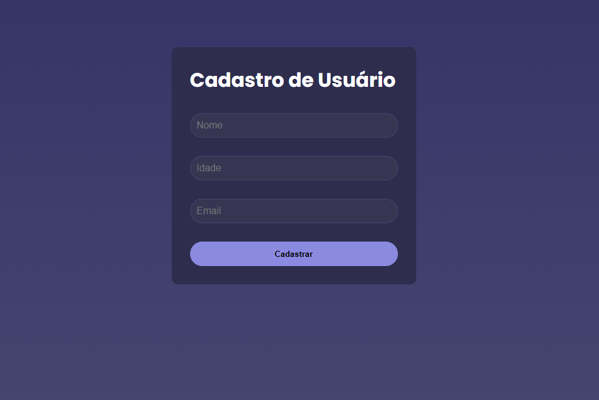

# Documentação do Projeto

## Visão Geral

Este projeto é uma aplicação de cadastro de usuários, onde é possível adicionar, listar e excluir usuários. Utiliza React como biblioteca principal para a construção da interface, Vite para otimização do desenvolvimento, ESLint para padronização do código, e Axios para o consumo de dados de uma API.

## Tecnologias Utilizadas

- **React**: Biblioteca JavaScript para construção de interfaces de usuário.
- **Vite**: Ferramenta de construção para desenvolvimento rápido.
- **ESLint**: Ferramenta de linting para garantir a qualidade do código.
- **Axios**: Biblioteca para realizar requisições HTTP.

## Configuração do Ambiente

1. **Instalação das Dependências**:
   ```bash
   npm install

2. Para iniciar a aplicação, utilize o seguinte comando:
   ```bash
   npm run dev

A aplicação estará disponível em http://localhost:3000.

<div>
    
</div>